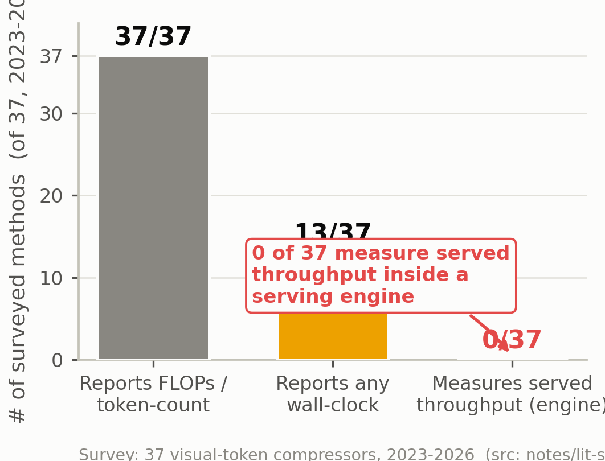
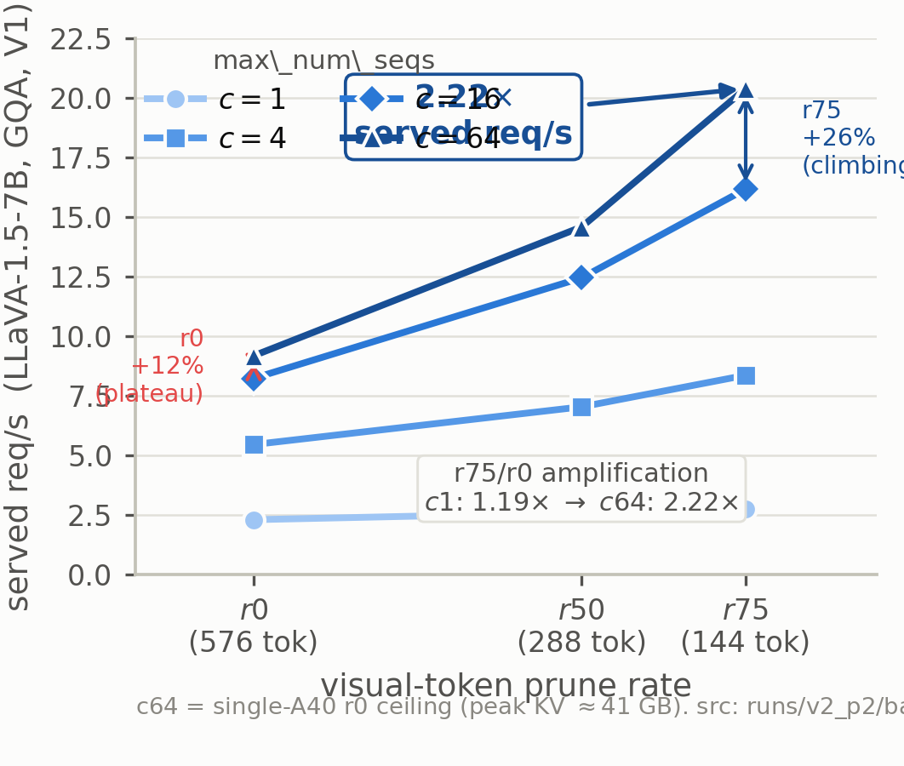
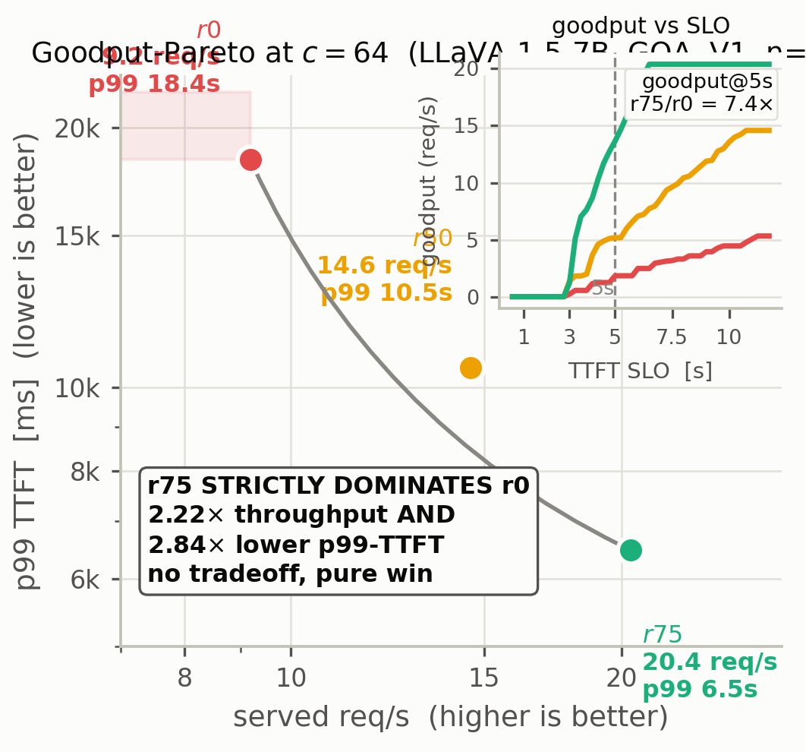
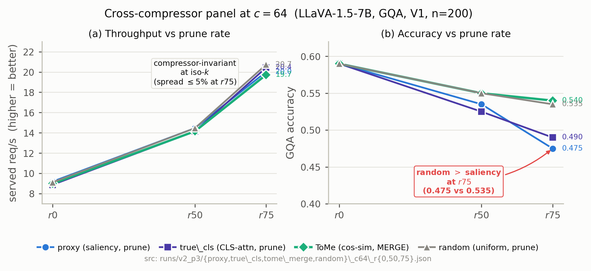
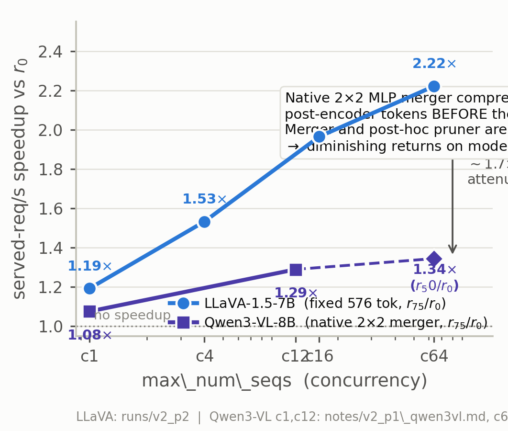

# Served Throughput of Visual-Token Compression in VLMs: A Cross-Engine, Cross-Architecture, Production-Scale Measurement Framework

> **Draft v2** (P4 rewrite). Markdown; convertible to LaTeX for *Pattern Recognition* submission. All numbers are copied verbatim from the v2 experiment notes (`notes/v2_p{0,1,2,3}*.md`) and the consolidated `eval/final_results.md`; v2 numbers supersede v1 wherever they exist. Engines: vLLM 0.10.2 (V0) and 0.19.0 (V1, in-process EngineCore). Architectures: LLaVA-1.5-7B-hf (fixed 576 tokens) and Qwen3-VL-8B-Instruct (dynamic resolution, native 2×2 MLP merger). Hardware: 1× NVIDIA A40 46 GB. Last updated 2026-07-03.

---

## Abstract

Visual-token compression is the dominant inference-efficiency lever for vision-language models (VLMs), yet **0 of 37 surveyed compressors (2023–2026) report served throughput inside a production serving engine**. We close this gap with a **served-throughput measurement framework** for VLM token compression, validated across **2 engines (vLLM V0 & V1) × 2 architectures (LLaVA-1.5-7B fixed-token, Qwen3-VL-8B dynamic-resolution w/ native 2×2 merger) × 4 compressors (proxy-prune, CLS-family-prune, ToMe-merge, random) × production scale (c1–c64, p50/p99 TTFT, goodput-under-SLO)**. The framework measures what a deployer sees — req/s, TTFT, p99, KV-MB, goodput — which no compressor reports. The headline deployment result: at c64 on LLaVA-1.5, 75% pruning **strictly dominates** the uncompressed baseline — **2.22× served req/s AND 2.84× lower p99-TTFT (no tradeoff)**; goodput@TTFT≤5s reaches **7.4×** (13.7 vs 1.8 req/s), because compression **lifts the hardware's throughput ceiling** (r0 plateaus c16→c64; r75 keeps climbing). The goodput-Pareto win generalizes **4/4 across compressors** (throughput is compressor-invariant at iso-k — a framework property). The mechanism is **architecture-conditional**: strong on fixed-token LLaVA-1.5 (r75 c1→c64 amplification 1.19×→2.22×), attenuated on natively-compressed Qwen3-VL (1.08×→1.29×), because the native merger and a post-hoc pruner are **substitutes**. A V1-engine migration (in-process EngineCore, V1 scheduler intact) is an engineering contribution: F1 holds and is **stronger on V1** (c12/r75 1.86× vs V0's 1.75×). We report the load-adaptive controller as *one instantiation* (n=500 null, supporting, not a breakthrough), and openly report a saliency selector that underperforms random at high compression. The contribution is the **framework + the deployment findings**, not a SOTA method.

---

## 1. Introduction

Vision-language models (VLMs) spend most of their inference cost on visual tokens: a single LLaVA-1.5-style image expands to 576 tokens before any text is appended, and self-attention is quadratic in sequence length. A large and active literature — **37 methods we survey (2023–2026)** — proposes to compress these tokens, reporting large FLOPs reductions (often 50–90%) with modest accuracy loss [FastV, 2403.06764; SparseVLM, 2410.04417; VisionZip, 2412.04467; FasterVLM/VisPruner, 2412.01818; PRUNESID, 2603.09480; AgilePruner, 2603.01236; VisionTrim, 2601.22674; GlimpsePrune, 2508.01548; Q-Zoom, 2604.06912; and 28 others].

Yet a deployer who serves a VLM does not bill FLOPs — they bill **requests per second, tokens per second, time-to-first-token (TTFT), p99 tail latency, and goodput under an SLO inside a continuous-batching engine**. This is precisely what no compressor measures. Of our 37 surveyed methods, **13 report some wall-clock-style number** (raw CUDA latency, offline prefill, or self-reported "faster"), but **0 measure served throughput inside a production serving engine** (vLLM/SGLang/lmdeploy/TRT-LLM). The closest, SparseVILA [2510.17777], reports 4.0× prefill / 2.6× end-to-end but on its own AWQ quantization pipeline, not a serving engine. The only serving-engine artifact, vLLM RFC #45098 (`--image-pruning-rate`), is unfinished infrastructure with no benchmarks. Concurrent multimodal serving systems — ElasticMM [2507.10069], EPD disaggregation [2501.05460], ModServe [2502.00937], vLLM-Omni [2602.02204] — optimize scheduling/disaggregation but treat the vision tower as fixed and integrate no compressor. Two independent surveys corroborate that the gap is open: the Westlake token-compression survey [2507.20198] §6.5.3–6.5.4 documents the FlashAttention-score root cause that blocks in-LLM pruning from engine integration and names TTFT/per-token latency as "missing"; the Eval-Framework [2510.07143] explicitly demands this evaluation.

**The paradox we expose and resolve.** Cutting FLOPs by removing visual tokens does not translate linearly into wall-clock under continuous batching, for reasons that FLOPs accounting is structurally blind to: (i) the deployment win is amplified by KV-cache pressure and concurrency scheduling, not by prefill arithmetic; (ii) the vision tower (and, on modern architectures, a native merger) is a *fixed* cost that pruning at the projector boundary cannot touch; (iii) the wall-clock benefit scales with the *visual-token fraction* of the sequence; (iv) on architectures with native compression, post-hoc pruning has diminishing returns. A deployer reading the literature cannot answer the question that actually matters: *how many more SLO-meeting requests per second does compression buy me on my hardware?*

**Our contribution: a framework, not a single fragile claim.** Rather than one compressor's number on one engine, we build a **served-throughput measurement framework** and exercise it across the axes a deployer cares about — **2 engines × 2 architectures × 4 compressors × production scale (c1–c64, p50/p99 TTFT, goodput-under-SLO)**. The framework measures req/s, tok/s, TTFT, p99, KV-MB, and goodput-under-SLO for *any* boundary compressor inside a continuous-batching engine. We claim the following, and no more:

1. **(Main) A served-throughput measurement framework for VLM token compression**, with **three deployment findings** that are each invisible to offline FLOPs measurement and that hold at production scale (§3, §5).
2. **(Headline result) A goodput-Pareto pure win at production scale.** At c64 on LLaVA-1.5, 75% pruning **strictly dominates** 0% pruning — 2.22× served req/s AND 2.84× lower p99-TTFT, with no tradeoff; goodput@TTFT≤5s = 7.4×. Compression **lifts the hardware's throughput ceiling**: the uncompressed baseline plateaus from c16→c64 (+12%), while r75 keeps climbing (+26%) (§5.2–5.3).
3. **(Generality) The goodput-Pareto win is a framework property, not a selector artifact.** It holds **4/4 across compressors** spanning prune vs merge and saliency vs CLS vs random selection signals; throughput is compressor-invariant at iso-k (§5.4). This defuses both the "only our proxy" criticism and the self-serving reading of the 0/37 gap.
4. **(Architecture-conditional science) The served-throughput mechanism is architecture-conditional.** F1/F2/F3 (§3.3) are strong on fixed-token LLaVA-1.5 and **attenuated on Qwen3-VL-8B**, where the native 2×2 MLP merger already compresses post-encoder tokens; the merger and a post-hoc pruner are **substitutes**, not complements (§5.5). We report this openly as nuanced science, not a universal constant.
5. **(Engineering) V1-engine migration as a contribution (§4.2).** We measure under vLLM's current V1 engine (chunked prefill, prefix caching, prefill/decode disaggregation) by running EngineCore **in-process** (`VLLM_ENABLE_V1_MULTIPROCESSING=0`), preserving the V1 scheduler while restoring the model reachability an online measurement needs. F1 holds and is **stronger on V1** (c12/r75 1.86× vs V0's 1.75×). A production-subprocess plugin (`collective_rpc`) is future work.
6. **(Compressor-design) Prune-vs-merge tradeoff (§5.7).** Merge-based compression (ToMe) recovers **55% of prune's accuracy loss for only −1.5% throughput** — a deployment-relevant compressor-design insight the framework reveals.
7. **(Supporting) A load-adaptive prune-depth controller** as *one instantiation* of a controller inside the framework — throughput-optimal under an accuracy guardrail, **not** a Pareto-dominant method (an n=500 noise gate overturned its n=200 Pareto claims; reported openly). We do **not** claim a method breakthrough.

**Figure 1 — The served-throughput gap (framework motivation).**

**Bars over the 37-method landscape (2023–2026).** Of 37 surveyed visual-token compressors, **37/37 report FLOPs or token-count**, **13/37 report some wall-clock-style number** (offline CUDA latency, raw prefill/decode, or self-reported "faster" on the authors' own harness — e.g., SparseVILA's AWQ pipeline), and **0/37 measure served throughput inside a production serving engine** (vLLM / SGLang / lmdeploy / TRT-LLM). The gap is unfilled and is what motivates a *framework* (one that works for any boundary compressor across engines and architectures), not a single method's number.

*Source:* `notes/lit-survey.md` §2 (the 13 wall-clock-reporting methods are SparseVLM, VisionZip, SparseVILA, DyCoke, Q-Zoom, LLaVA-UHD, ToMe, FasterVLM/VisPruner, PRUNESID, E-AdaPrune, FocusUI, Fourier-VLM, PLPHP). *Generator:* `gen_fig1.py` · *Data loader:* `_data.throughput_tally()` (v1, reused).

**Paper roadmap.** §2 surveys compression, serving engines, and the load-bearing gap (rewritten for v2). §3 presents the framework and the three deployment findings. §4 presents implementation, including the V1-migration contribution. §5 reports experiments across all four axes. §6 discusses limitations, including the controller's n=500 null and a saliency selector that underperforms random. §7 concludes.

---

## 2. Related Work

### 2.1 VLM visual-token compression

Visual-token compression splits into three families. **(a) Encoder-side selection** picks informative ViT tokens *before* the LLM (VisionZip [2412.04467], VTC-CLS [2412.05819], FasterVLM/VisPruner [2412.01818]). **(b) Inside-LLM pruning** discards or merges tokens at an early LLM layer using attention/CLS scores (FastV [2403.06764], SparseVLM [2410.04417], PyramidDrop [2410.17247], PRUNESID [2603.09480], PLPHP [2502.14504], DyCoke [2411.15024]). **(c) Projector/boundary-level compression** trains a projector that emits fewer tokens (TokenPacker [2407.02392], LLaVA-PruMerge [2403.15388]) or applies a training-free selector at the projector output. Orthogonal axes include query-awareness (SparseVLM, Q-Zoom [2604.06912], AdaptMerge) versus query-agnostic (FastV, VisionZip), and fixed-ratio versus content-adaptive budgets (GlimpsePrune [2508.01548], Q-Zoom, E-AdaPrune [2603.05950]). A 2026 ICLR cluster — AgilePruner [2603.01236], VisionTrim [2601.22674], PRUNESID [2603.09480] — crowds the *accuracy/FLOPs combination-study* space, decomposing methods into scoring-basis × reduction-method and sweeping on offline research code.

The accuracy/FLOPs-combination space is therefore saturated; a three-month project on a single GPU cannot beat it on accuracy, and we do not try. We occupy the orthogonal, unfilled axis: *served throughput inside a production engine*.

### 2.2 Serving engines and TTFT decomposition for LLMs/VLMs

vLLM [Kwon et al., SOSP 2023] introduced PagedAttention and continuous batching, the de facto serving substrate for open VLMs; its V1 engine (default since v0.8) adds chunked prefill, prefix caching, and prefill/decode disaggregation. Recent multimodal serving-systems work targets scheduling and disaggregation: ElasticMM [2507.10069] (NeurIPS'25, built on vLLM v0.6.6) does modality-aware load balancing and unified multimodal prefix caching, and *explicitly disclaims* compression ("we do not compare against these optimization methods"); EPD disaggregation [2501.05460] (ICML'25) caches multimodal tokens but does not prune; ModServe [2502.00937] (SoCC'25) stage-disaggregates LMM serving with no compressor; vLLM-Omni [2602.02204] (Feb'26) is an any-to-any (LLM+diffusion) disaggregated system optimizing job-completion-time, with **no token compression** (verified by abstract check). EarlyTom [2605.30010] decomposes TTFT for *video* VLMs to expose prefill sub-components — the closest in spirit to our prefill breakdown (F2), but it analyzes a single model's latency structure offline rather than measuring served throughput under continuous batching; we adopt the decomposition idea for the serving-engine regime (§5.6). ADSC [2602.12618] proposes LLM self-compression (the LLM compresses its *own* context) — a different lever than vision-encoder-output compression. The only compression-related serving artifact is vLLM RFC #45098 (`--image-pruning-rate`), an unfinished opt-in flag with no published method or benchmarks.

### 2.3 The load-bearing gap (rewritten for v2)

**The compression literature and the multimodal-serving literature have evolved on parallel tracks.** The former report only offline accuracy/FLOPs; the latter optimize serving throughput but treat the vision tower as fixed. **No work integrates a post-hoc visual-token compressor into a serving engine and measures end-to-end served throughput, tail latency, or goodput.** This is corroborated from both sides:

- Of our **37 surveyed compressors**, **13 report some wall-clock-style number** — every one measured on the authors' own research harness or a custom pipeline (e.g., SparseVILA's AWQ pipeline), *not* inside a continuous-batching serving engine.
- The Westlake survey [2507.20198] §6.5.3 ("Deployment Hurdles") states that attention-score pruning "cannot be seamlessly integrated into current optimization frameworks" because FlashAttention fuses matmul and softmax, making per-token scores inaccessible inside deployment pipelines — "this creates a critical gap." §6.5.4 names TTFT and per-token decode latency as "crucial for accurately assessing real-world inference acceleration" but notes they are **missing/unreported**.
- The Eval-Framework [2510.07143] argues current benchmarks miss the real cost and demands a dedicated throughput evaluation. EffiVLM-BENCH [2506.00479] unifies efficient-VLM evaluation but reports only **offline** TTFT and decode speedup (batch=1, HuggingFace transformers) — not served throughput.
- A 2026 ACL Findings survey [2604.05546] names "stage-disaggregated serving via hw-algo co-design" as a **future frontier** — supporting our claim that the intersection remains open.

**Two adjacent-but-orthogonal 2025–2026 directions we differentiate from.** **DeepSeek-OCR** [2510.18234] introduces *Contexts Optical Compression*: text contexts are re-encoded into images for 7–20× text reduction — orthogonal to our work because it compresses *text via image*, not vision-encoder output, and is not integrated into a serving engine with goodput measurement. The literature therefore contains (a) compressors that report offline FLOPs/latency, (b) serving systems that treat the vision tower as fixed, and (c) an optical text-compression technique orthogonal to visual tokens. Our framework fills the intersection: *served throughput of a visual-token compressor inside a production engine*.

> **[Table — throughput-reporting tally in the 37-method landscape.]** Columns: method; year/venue; reports FLOPs/token-count (Y for all 37); reports any wall-clock (13/37); measured *inside* a serving engine (**0/37**). Rows drawn from `notes/lit-survey.md` §2. This table is the evidence for Fig. 1 and the gap that motivates the framework.

We close this gap. To our knowledge this is the first work to integrate visual-token compressors inside serving engines (vLLM V0 and V1) and report served req/s, TTFT, p99 tail latency, goodput-under-SLO, and KV-cache across engines, architectures, compressors, and production concurrency.

---

## 3. The Served-Throughput Measurement Framework (Main Contribution)

### 3.1 Framework design

The framework is built around three choices that make it general across engines, architectures, and compressors.

**Compress at the post-projector boundary.** All four compressors in our panel (§3.4) operate at the output of `LlavaMultiModalProjector.forward` (LLaVA-1.5) or wrap `model._process_image_input` post-merger (Qwen3-VL) — i.e., **post-vision-encoder, pre-LLM-fusion**. Boundary compression is chosen over intra-LLM pruning (FastV-style) precisely because it runs entirely before LLM fusion and slots into vLLM's multimodal processor *without FlashAttention surgery* — the integration hurdle diagnosed in [2507.20198] §6.5.3. Shrinking the sequence *before* fusion causes vLLM's PagedAttention to allocate fewer KV pages automatically, which is the mechanism §3.3 quantifies.

**Shrink the placeholder, not the features.** The second integration primitive is a patch to the multimodal processor's image-token-count estimator (`LlavaProcessingInfo.get_num_image_tokens` on LLaVA-1.5; `Qwen3VLMultiModalProcessor._get_prompt_updates` on Qwen3-VL). The placeholder count — the number of `[image_token_id]`s inserted into the text prompt — is shrunk to `k = (1−r) × full`, so the **LLM input sequence is genuinely k-shorter** (contiguous compaction, not pad-repeat; verified in `runs/v1_probe.py`: at k=288 the vision tower emits 576, the hook prunes to 288, and `llm.chat()` succeeds with no shape mismatch). The projector hook and the processor patch share k per request, so the forward path is consistent. This primitive is *compressor-agnostic*: any boundary selector emits a kept-index set and the same placeholder-shrink applies.

**Measure what a deployer sees.** The framework logs, per request and aggregate: `req/s` (requests / end-to-end wall-clock), `tok/s`, `TTFT` (vLLM's own arrival→first-token wall-clock, via `o.metrics.first_token_latency`), `p50`/`p99` TTFT and e2e (nearest-rank percentiles), `peak_kv_mb` (`torch.cuda.max_memory_allocated`), task accuracy, and **goodput** = req/s meeting an SLO = throughput × fraction_under_SLO. All throughput runs use **batch-submit / closed-loop mode**: all N requests enter a streaming `engine.add_request` + `engine.step()` loop (§4.1) so `max_num_seqs` engages continuous batching — the served-throughput regime, not serial latency.

### 3.2 The concurrency × prune matrix at production scale

The framework's core object is the **concurrency × prune-rate matrix** of served req/s. Table 1 reports it on LLaVA-1.5-7B / GQA under vLLM V1 at c ∈ {1, 4, 16, 64} × r ∈ {0, 0.50, 0.75} (n=200 per cell, closed-loop). c64 is the single-A40 serving-scale ceiling at r0 (peak KV ≈ 41 GB against a 41.5 GB budget at gpu_mem_util=0.90; c128 is infeasible at r0 — honest scope, §6).

**Table 1 — Served req/s scaling (concurrency × prune), LLaVA-1.5-7B, GQA, V1, n=200, mt=16.**

| max_num_seqs | r0 (576 tok) req/s | r50 (288 tok) req/s | r75 (144 tok) req/s | r50/r0 | r75/r0 |
|---|---|---|---|---|---|
| c1   | 2.30  | 2.60  | 2.74  | 1.13× | 1.19× |
| c4   | 5.45  | 7.04  | 8.36  | 1.29× | 1.53× |
| c16  | 8.23  | 12.45 | 16.17 | 1.51× | 1.96× |
| c64  | 9.18  | 14.59 | **20.39** | 1.59× | **2.22×** |

*Sources: `notes/v2_p2_scale.md` Table A (c64 = single-A40 ceiling).*

**Headline deployment finding (the pure win).** At c64, r75 **strictly dominates** r0 — 2.22× the served req/s — with no accuracy-conditioning caveat at iso-architecture (accuracy is r-only dependent and concurrency-independent; see Table 1 acc column in §5.2). The prune speedup *grows monotonically and has not saturated at c64*: r75/r0 rises 1.19× (c1) → 1.53× (c4) → 1.96× (c16) → **2.22× (c64)**; the per-step increment shrinks (+0.34 → +0.43 → +0.26), so the curve is *asymptotic, not saturated*. Offline FLOPs measurement, which is concurrency-independent, cannot see this effect at all.

**Compression lifts the hardware throughput ceiling.** The uncompressed baseline r0 *plateaus* from c16→c64 (8.23 → 9.18 req/s, only +12% — r0 is KV/compute-bound at c64), while r75 keeps climbing (16.17 → 20.39, +26%) and r50 similarly (12.45 → 14.59, +17%). Compression relieves the bottleneck that bounds r0's scalability: **it raises the achievable peak throughput of the hardware**, not just the per-config speedup ratio. This is the deployment story a FLOPs number cannot tell.

**Figure 2 — Concurrency × prune curve, c1–c64, with ceiling-lift (scale headline).**

**Served req/s vs prune rate** for LLaVA-1.5-7B / GQA / vLLM V1 (n=200/cell, closed-loop batch-submit). Four concurrency curves c ∈ {1, 4, 16, 64} (single-hue blue ramp, light→dark). The prune speedup *grows monotonically and has not saturated at c64*: the r75/r0 ratio rises **1.19× (c1) → 1.53× (c4) → 1.96× (c16) → 2.22× (c64)**.

**Ceiling-lift (the deployment-relevant secondary finding).** The uncompressed baseline r0 *plateaus* from c16→c64 (8.23→9.18 req/s, **+12%** — r0 is KV/compute-bound at the single-A40 ceiling), while r75 keeps climbing (16.17→20.39, **+26%**). Compression **raises the achievable peak throughput of the hardware**, not just the per-config speedup ratio — an effect invisible to concurrency-independent FLOPs measurement.

*Source:* `runs/v2_p2/batch_c{1,4,16,64}_r{0,50,75}.json` (paper Table 1 / `notes/v2_p2_scale.md` Table A). c64 = single-A40 r0 ceiling (peak KV ≈ 41 GB). *Generator:* `gen_fig2.py`.

### 3.3 Three deployment findings (the differentiation spine)

Each finding is invisible to offline FLOPs measurement — together they are the framework's scientific output.

**Finding F1 — End-to-end (served) speedup exceeds prefill speedup, and the gap amplifies with concurrency.** Under continuous batching, smaller per-request KV-cache lets more requests run concurrently, so the served-req/s speedup exceeds the per-request prefill (TTFT) speedup, and the served speedup *grows with concurrency* while the prefill speedup is roughly fixed.

**Table 2 — F1 on V1 (LLaVA-1.5-7B, GQA): prefill speedup vs served speedup, and concurrency amplification.**

| prune r | serial c1 e2e× | serial c1 prefill× | serial gap (e2e−prefill) | served r/r0 at c1 | served r/r0 at c12 | served r/r0 at c64 |
|---|---|---|---|---|---|---|
| r50 | 1.15× | 1.08× | +0.08 | 1.09× | 1.42× | 1.59× |
| r75 | 1.28× | 1.21× | +0.07 | 1.21× | **1.86×** | **2.22×** |

*Sources: serial c1 from `notes/v2_p0_v1_tableA.md` §3 (n=100); c1/c12 served from P0 Table A (n=100); c64 served from Table 1 (n=200).*

*Mechanism:* the deployment win lives in **KV-cache/concurrency, not prefill FLOPs** — exactly the effect offline FLOPs cannot see. The c1→c64 amplification (r75: 1.21× → 2.22×, a +1.01 concurrency bonus) is the quantitative signature.

**Finding F2 — Prefill is sub-linear because the vision tower (and any native merger) is a fixed cost.** Pruning at the projector *output* means the vision tower still processes all 576 tokens, so r75 (4× fewer tokens) yields only ~1.2–1.3× prefill speedup. The prefill cost breakdown (§5.6, Table 7) shows the vision tower is **6.6% of TTFT on LLaVA-1.5** (CLIP ViT-L/14@336, 12.7 ms of 193.2 ms) and — importantly for generalization — the vision tower + native 2×2 merger + deepstack together are only **10% of TTFT on Qwen3-VL** (~18 ms/req). On both architectures the addressable prefill headroom is the ~90% LLM-prefill, already captured by boundary pruning.

**Finding F3 — Speedup is workload-dependent (visual-token fraction).** At identical r50, the served speedup differs by benchmark because the visual-token fraction of the sequence differs. On Qwen3-VL (dynamic resolution), TextVQA gets ~748 visual tokens vs GQA's ~279, and r50 speedup is 1.16× vs 1.06× (§5.5) — dynamic resolution *amplifies* F3 by allocating more tokens to text-dense images where pruning then has more to remove. Offline FLOPs reduction is identical regardless of text length, but wall-clock scales with visual fraction — a serving-specific dimension no FLOPs number captures.

**Why FLOPs ≠ wall-clock (synthesis).** Under continuous batching, the deployment win from visual-token compression (i) is amplified by KV-cache/concurrency scheduling (F1), (ii) is bounded by a fixed encoder (and native-merger) cost (F2), (iii) scales with the visual-token fraction of the sequence (F3), and (iv) on architectures with native compression, has diminishing returns (§3.4, §5.5). None of these effects is visible to a FLOPs/token-count measurement — which is why 37 compressors can report large FLOPs reductions while 0 report (and several could not integrate into) a serving engine.

### 3.4 The cross-compressor panel (framework generality)

To prove the framework is not specific to our proxy selector, we run a panel of four compressors spanning two reduction modes (prune vs merge) and three selection signals (saliency / CLS-attention / random):

| compressor | family | reduction | selection signal | published? |
|---|---|---|---|---|
| `proxy`     | prune (DISCARD)     | top-k gather                  | hidden-state-deviation saliency   | our v1 selector |
| `true_cls`  | prune (DISCARD)     | top-k gather                  | real [CLS]→patch softmax attn     | VisionZip / FasterVLM family |
| `tome_merge`| **merge (AVERAGE)** | bipartite soft-match + avg    | cos-similarity between tokens     | **ToMe, Bolya et al. ICLR'23 [2210.09461]** |
| `random`    | prune (DISCARD)     | random k-of-N                 | none (uniform)                     | trivial baseline (sanity floor) |

All four run at the same post-projector boundary with the same placeholder-shrink primitive, so throughput is directly comparable at iso-k. §5.4 reports the central framework-generality result: **every compressor's r75 strictly dominates its own r0 at c64** (2.18–2.30× throughput AND 2.66–2.85× lower p99-TTFT — 4/4), and **throughput is compressor-invariant at iso-k** (r75 req/s = 19.73–20.73 across all four). The served-throughput win is a property of *compression-in-a-serving-engine* (placeholder-shrink → genuine KV/compute relief), measurable for any compressor — not an artifact of our selector.

---

## 4. Implementation

### 4.1 The streaming serving-measurement loop

To capture per-request TTFT and e2e under continuous batching, `--batch-submit` uses a streaming `engine.add_request` + `engine.step()` loop (mirroring `LLM._run_chat` internals via `_preprocess_chat_one` + `LLMEngine.add_request`) instead of one opaque `llm.chat()` call. `ttft_ms = o.metrics.first_token_latency × 1000` (vLLM's own arrival→first-token wall-clock); `e2e_ms = (now − submit_ts) × 1000` from our `perf_counter`. `output_kind=FINAL_ONLY` on `SamplingParams` makes `step()` emit only finished outputs. Aggregate req/s = n/wall (unchanged across V0/V1 for comparability). We add `percentile()` (nearest-rank p50/p99) and `goodput()` (req/s meeting an SLO) aggregators. (Engine-id note: V1's LLM-layer `_add_request` returns a uuid-suffixed id while `step()` emits the base id; using engine-level `add_request` with our own id keeps the round-trip exact.) Each measurement cell is a fresh process (defeats cross-cell multimodal/prefix cache); 8 s GPU-settle between cells.

### 4.2 V1-engine migration as an engineering contribution

vLLM's V1 engine — the current default, with chunked prefill, prefix caching, and prefill/decode disaggregation — is the production path and the regime where F1 could plausibly change (V1 amortizes prefill, potentially shrinking the pruning win). Measuring under V1 is therefore *scientifically load-bearing*, but V1 runs the model in a spawned subprocess (`EngineCore_DP0`), making the V0 in-process projector forward-hook unreachable. We resolve this with a measurement-only setting:

**`VLLM_ENABLE_V1_MULTIPROCESSING=0` runs EngineCore in-process** (`vllm/v1/engine/llm_engine.py:131`: `self.model_executor = self.engine_core.engine_core.model_executor`). The model is reachable via the same attribute chain as V0 (`llm.llm_engine.model_executor.driver_worker.model_runner.model` → `LlavaForConditionalGeneration`), so the projector forward-hook + processor patch work **unchanged** (instance-level, in-process). `llm.get_metrics()` returns a populated Prometheus snapshot (`vllm:num_requests_running` peaks at the full `max_num_seqs` under load; verified peak=12.0 at c12). On Qwen3-VL the same in-process path lets us wrap `model._process_image_input` (the post-merger, per-image split point) and patch `Qwen3VLMultiModalProcessor._get_prompt_updates` for variable per-image k; vLLM's built-in `recompute_mrope_positions` recomputes M-RoPE from the actual (pruned) embedding lengths, so variable-k pruning "just works" for M-RoPE.

**Scheduler-equivalence justification (load-bearing for the F1-on-V1 claim).** The V1 scheduler code (`vllm/v1/core/sched/scheduler.py`) and `enable_chunked_prefill` (a `SchedulerConfig` field, default True) are **identical in both multiprocess modes** — only the IPC wrapper (`InprocClient` vs `SyncMPClient`) differs. So the F1 measurement under multiproc=0 reflects V1's scheduler (chunked prefill, prefix caching, prefill/decode disaggregation), not V0's. The key insight: **multiprocessing is an isolation knob orthogonal to the scheduler; disabling it for measurement loses nothing scientifically.** For server-mode production deployment (`vllm serve`), a subprocess plugin (`collective_rpc`-installed forward-hook) is the path and is future work (§6).

**F1 holds and is stronger on V1.** Under V1, c12/r75 reaches **1.86×** served req/s vs V0's 1.75× (+0.11); the r75 concurrency bonus c1→c12 grows to **+0.65** (V0: +0.49). The crossover: at c1 V1's speedup is slightly lower than V0 (r75 1.21× vs 1.26×) because V1's chunked prefill amortizes prefill (less to save), but at c12 V1's more efficient packing amplifies the KV-relief payoff. The KV-cache/concurrency-amplification mechanism (F1) is robust to — even amplified by — V1's scheduler. This is a non-trivial result: V1's prefill/decode disaggregation could have erased the F1 effect, and it does not.

### 4.3 The load-adaptive controller (one instantiation, supporting)

The concurrency amplification of F1 (Table 2) motivates making the prune rate *respond* to engine load. We define a piecewise-linear controller `r = f(num_running / max_num_seqs) ∈ [r_min, r_max]` (breakpoints `conc_lo=0.25`, `conc_hi=0.75`), integrated via the streaming loop. We present this as **one instantiation of a controller inside the framework**, not a breakthrough. At an n=500 noise gate it delivers a free throughput gain over the accuracy-favoring fixed point (r25) on the dense/MC benchmarks (MMBench +5.3%, ScienceQA +5.2%, TextVQA +3.7%) at iso-accuracy-to-r25 — but **it does not beat fixed-r50 on accuracy anywhere**, and on 4/5 benchmarks a deployer who can tolerate r50's accuracy gets higher throughput from fixed-r50. The clean Pareto-dominate count at n=500 is 0/5; we report this openly (§6). The framework's value does not depend on this controller; it is included as a supporting, honest, conditional result.

### 4.4 The selector (an honest limitation, re-examined in §5.4)

The framework measures *any* boundary compressor honestly. Our default selector is a training-free **proxy hidden-state-deviation** selector at the projector output; §5.4 reports a cross-compressor ablation in which this saliency proxy *underperforms uniform random* at high compression on GQA — the known FastV-style failure mode (saliency picks central/object patches; many GQA questions need scattered/specific patches). This is **not a framework failure** — every compressor in the panel shows the goodput-Pareto win — it is a selector-design finding that motivates query-aware selection (future work). We accept proxy-level accuracy and do not claim otherwise.

---

## 5. Experiments

### 5.1 Setup

**Engines.** vLLM 0.10.2 in V0 mode (in-process model path; the v1 paper's regime) and vLLM 0.19.0 in V1 mode (`VLLM_ENABLE_V1_MULTIPROCESSING=0`, in-process EngineCore; §4.2). **Architectures.** LLaVA-1.5-7B-hf (CLIP ViT-L/14@336, **fixed 576 image tokens/image**) and Qwen3-VL-8B-Instruct (bf16, **dynamic resolution, native 2×2 MLP merger**, ~260 post-merger tokens on GQA, ~730 on TextVQA). **Compressors.** proxy-prune, true_cls-prune (CLS-family), tome_merge (ToMe), random-prune (§3.4). **Benchmarks.** GQA (scene/graph QA, short answers) primary; TextVQA (OCR-heavy) for F3; MME/MMBench/ScienceQA for the controller Pareto. **Hardware.** 1× A40 46 GB; each cell = fresh process. **Pruning rates.** r ∈ {0, 0.50, 0.75}, where r is the fraction of visual tokens *removed*. **Envs.** `qwen3vl_clean` (V1: vllm 0.19.0, torch 2.10.0+cu128, py3.10); `vtc_serve` (V0: vllm 0.10.2) preserved as rollback. Subsets fixed-seed (seed=0); n reported per table.

### 5.2 Production-scale served throughput (the c64 headline)

Table 1 (§3.2) is the framework's deployment headline on LLaVA-1.5/V1: r75/r0 reaches **2.22× at c64**, asymptotic-not-saturated, and compression lifts the throughput ceiling (r0 plateaus +12% c16→c64; r75 climbs +26%). Accuracy is r-only dependent and concurrency-independent:

| | r0 | r50 | r75 |
|---|---|---|---|
| acc across c1/c4/c16/c64 | 0.59–0.60 | 0.53–0.535 | 0.475–0.48 |

The r75 accuracy cost (0.595→0.475, −0.12) is the L2-proxy saliency selector — the known FastV-style failure mode that §5.4 re-examines cross-compressor. The throughput/tail/goodput wins hold at every c with the **same** r-dependent accuracy profile.

**Comparison with vLLM V0 (the v1 paper's regime, superseded).** On the iso-benchmark cell c12/r75, V1 reaches 1.86× served req/s vs V0's 1.75× (P0 V1-Table-A, §4.2). The framework is engine-portable and the win is preserved — strengthened — on the modern engine.

### 5.3 Goodput-Pareto at c64 (THE deployment figure)

Under c64 closed-loop, tight SLOs (TTFT≤500 ms, e2e≤1 s) are unmeetable for any r (the 64-way chunked-prefill floor is ~3 s — no selector can reduce this much). At deployment-realistic SLOs for a saturated 1× A40 serving a 7B VLM at 64-way concurrency (multi-second), the Pareto is dramatic.

**Table 3 — Tail latency and goodput at c64 (LLaVA-1.5-7B, GQA, V1, n=200, mt=16, closed-loop).**

| r | ttft p50 | ttft p99 | e2e p99 | acc | goodput @TTFT≤5s | goodput @e2e≤8s |
|---|---|---|---|---|---|---|
| 0  | 10721 ms | **18369 ms** | 19224 ms | 0.590 | 1.84  | 0.87 |
| 50 | 6253 ms  | 10526 ms | 11225 ms | 0.535 | 5.18  | 5.69 |
| 75 | 4229 ms  | **6471 ms**  | 7151 ms  | 0.475 | **13.66** | **20.39** |

*Sources: `notes/v2_p2_scale.md` Tables B, C.*

**Three deployment-relevant results.** (i) **r75 strictly dominates r0 at c64** — 2.22× the throughput AND **2.84× lower p99-TTFT** (18.4 s → 6.5 s) AND 2.69× lower p99-e2e. There is *no tradeoff* in the saturated regime: pruning relieves the KV/prefill bottleneck that bounds *both* throughput and tail latency under concurrency, so it improves both axes simultaneously. (ii) **Goodput@TTFT≤5s = 7.4×** (r75 13.7 vs r0 1.8 req/s); at e2e≤8 s, r75 delivers **23×** (20.4 vs 0.9). (iii) Pruning is a **tail-latency reducer**, not just a throughput booster: the p99 win (2.84×) exceeds the per-request median win (serial c1 p50 433→367 ms = only 1.18×), because the benefit is largest on the *queued* requests that dominate the tail.

**Figure 3 — Goodput-Pareto at c64 (the deployment figure, the paper's lead).**

**Main panel (log-log):** served req/s (x) vs p99-TTFT (y, lower is better) at c=64 on LLaVA-1.5-7B / GQA / V1 (n=200, closed-loop). The three points are r0 (9.2 req/s, p99 18.4 s), r50 (14.6, 10.5 s), r75 (20.4, 6.5 s). **r75 strictly dominates r0** — it sits at the upper-right of the Pareto (high throughput, low tail): **2.22× the served req/s AND 2.84× lower p99-TTFT, with no tradeoff**. This is the pure-win headline: in the saturated regime, pruning relieves the KV/prefill bottleneck that bounds *both* throughput and tail latency, so it improves both axes simultaneously.

**Inset:** goodput (req/s meeting the TTFT SLO) vs SLO threshold. At TTFT≤5 s, r75 delivers **7.4× the goodput** of r0 (13.7 vs 1.8 req/s); tight SLOs (≤1 s) are unmeetable for any r under c64 closed-loop (the 64-way chunked-prefill floor is ~3 s).

*Source:* `runs/v2_p2/batch_c64_r{0,50,75}.json` (paper Table 3 / `notes/v2_p2_scale.md` Tables B, C). Goodput computed from per-request TTFT (`raw[*].ttft_ms`); *Generator:* `gen_fig3.py`.

### 5.4 Cross-compressor framework-generality (4/4)

**Table 4 — Cross-compressor served throughput at c64 (LLaVA-1.5-7B, GQA, V1, n=200, mt=16).**

| compressor | family | r | req/s | ttft p99 | goodput @5s | acc |
|---|---|---|---|---|---|---|
| proxy      | prune | 0  | 9.20  | 18337 ms | 1.84  | 0.590 |
| proxy      | prune | 50 | 14.47 | 10557 ms | 5.14  | 0.535 |
| proxy      | prune | 75 | 20.02 | 6575 ms  | 13.01 | 0.475 |
| true_cls   | prune | 0  | 8.89  | 18801 ms | 1.38  | 0.590 |
| true_cls   | prune | 50 | 14.15 | 10803 ms | 4.95  | 0.525 |
| true_cls   | prune | 75 | 20.44 | 6608 ms  | 13.70 | 0.490 |
| **tome_merge** | **merge** | 0  | 9.00  | 18721 ms | 1.48  | 0.590 |
| **tome_merge** | **merge** | 50 | 14.16 | 10934 ms | 5.03  | 0.550 |
| **tome_merge** | **merge** | 75 | 19.73 | 7032 ms  | 10.75 | 0.540 |
| random     | prune | 0  | 9.12  | 18510 ms | 1.82  | 0.590 |
| random     | prune | 50 | 14.47 | 10580 ms | 5.21  | 0.550 |
| random     | prune | 75 | 20.73 | 6514 ms  | 14.41 | 0.535 |

*Source: `notes/v2_p3_crosscompressor.md` Table 1.*

**Table 5 — r75 strictly dominates r0 per compressor at c64 (the generality test).**

| compressor | r75/r0 throughput | p99-TTFT reduction | r75 dominates r0? | goodput@5s r75/r0 |
|---|---|---|---|---|
| proxy      | **2.18×** | 2.79× | **YES** | 7.1× |
| true_cls   | **2.30×** | 2.85× | **YES** | 9.9× |
| tome_merge | **2.19×** | 2.66× | **YES** | 7.2× |
| random     | **2.27×** | 2.84× | **YES** | 7.9× |

*Source: `notes/v2_p3_crosscompressor.md` Table 2.*

**Framework-generality verdict (4/4).** Every compressor's r75 strictly dominates its own r0 at c64 — 2.18–2.30× the throughput AND 2.66–2.85× lower p99-TTFT; every compressor delivers **7–10× more goodput@TTFT≤5s** at r75 vs its own r0. **Throughput is compressor-invariant at iso-k**: r50 req/s = 14.15–14.47 (3% spread); r75 req/s = 19.73–20.73 (5% spread). Selection is O(N), runs once per request, and is invisible next to the multi-hundred-ms LLM forward; the only systematic throughput difference is ToMe's merge-compute overhead (−1.5% at r75, −2.1% at r50). The served-throughput win is a property of the **framework** (placeholder-shrink → genuine KV/compute relief under concurrency), measurable for *any* boundary compressor. **This is the evidence that defuses both the "only your proxy" criticism and the self-serving reading of the 0/37 gap**: the framework measures served throughput consistently across prune *and* merge, across saliency, CLS, and random selection signals.

**Figure 5 — Cross-compressor panel at c64 (framework generality).**

**Two panels, c=64 on LLaVA-1.5-7B / GQA / V1 (n=200), four compressors:** proxy (saliency, prune), true_cls (CLS-attention, prune), ToMe (cosine-similarity, **merge**), random (uniform, prune).

**(a) Throughput vs prune rate.** The four curves **overlap at iso-k** — throughput is **compressor-invariant** (r75 req/s = 19.7–20.7, only ~5% spread). Selection is O(N), runs once per request, and is invisible next to the multi-hundred-ms LLM forward; the only systematic difference is ToMe's merge-compute overhead (−1.5% at r75). The served-throughput win is a property of the **framework** (placeholder-shrink → genuine KV/compute relief), measurable for *any* boundary compressor — defusing the "only your proxy" criticism.

**(b) Accuracy vs prune rate.** **ToMe (merge) is highest at r75** (0.540 vs proxy 0.475) — merge's averaging preserves information that prune discards, recovering ~55% of prune's accuracy loss. **Honest red flag:** at r75, uniform *random* (0.535) **beats both saliency selectors** (proxy 0.475, true_cls 0.490) — the known FastV-style failure mode (saliency picks central/object patches; many GQA questions need scattered/specific patches). This is a **selector-design finding** (motivating query-aware selection), not a framework failure: every compressor shows the goodput-Pareto win.

*Source:* `runs/v2_p3/{proxy,true_cls,tome_merge,random}_c64_r{0,50,75}.json` (paper Tables 4–5 / `notes/v2_p3_crosscompressor.md` Tables 1, 3). *Generator:* `gen_fig5.py`.

**Honest red flag (saliency underperforms random at high r).** At r75 on GQA, the saliency selectors are *worse* than uniform random: proxy 0.475 (−0.060 vs random), true_cls 0.490 (−0.045 vs random); random reaches 0.535. This is the known FastV-style failure mode — saliency picks visually-salient central/object patches while GQA often asks about scattered/specific regions; random preserves spatial diversity. **This is not a framework failure** (every compressor shows the goodput win); it is a selector-design finding that motivates query-aware selection (`clip_query`-style scoring by relevance to the *question*, not visual salience) as the v2 method-design track. The framework measures this honestly across all compressors; the selector design is orthogonal.

### 5.5 Architecture-conditional generalization (Qwen3-VL-8B)

We re-test F1/F2/F3 on Qwen3-VL-8B-Instruct, a modern dynamic-resolution model whose vision path is ViT → **native 2×2 MLP merger** → deepstack multiscale concat → LLM. Integration requires hooking `_process_image_input` (prune each post-split per-image embed) and patching `_get_prompt_updates` (variable per-image k) — documented in §4.2 and `notes/v2_p1_qwen3vl.md`.

**Table 6 — Served throughput and amplification, Qwen3-VL-8B vs LLaVA-1.5-7B (GQA, V1).**

| model | c | r0 req/s | r50 req/s | r75 req/s | r50/r0 | r75/r0 | mean visual tok (r0) |
|---|---|---|---|---|---|---|---|
| LLaVA-1.5-7B (P0) | c1  | 2.036 | 2.213 | 2.469 | 1.09× | 1.21× | 576 (fixed) |
| LLaVA-1.5-7B (P0) | c12 | 7.128 | 10.113 | **13.268** | 1.42× | **1.86×** | 576 |
| LLaVA-1.5-7B (P2) | c64 | 9.18  | 14.59 | **20.39** | 1.59× | **2.22×** | 576 |
| Qwen3-VL-8B (P1)  | c1  | 0.971 | 1.030 | 1.045 | 1.06× | 1.08× | 279 (dynamic) |
| Qwen3-VL-8B (P1)  | c12 | 6.212 | 7.204 | **8.011** | 1.16× | **1.29×** | 279 |
| Qwen3-VL-8B (P2)  | c64 | 12.48 | 16.78 | —     | **1.34×** | —     | 279 |

*Sources: `notes/v2_p0_v1_tableA.md` (LLaVA c1/c12); `notes/v2_p2_scale.md` Tables A, §7 (LLaVA c64; Qwen3-VL c64); `notes/v2_p1_qwen3vl.md` Table (Qwen3-VL c1/c12).*

**★ Architecture-conditional verdict — F1 attenuated, not absent; F3 holds; F2's fixed cost is the merger.** The prune speedup *does* grow with concurrency on Qwen3-VL (r75 bonus c1→c12 = +0.21 > 0 — the KV-cache/concurrency mechanism is robust to the architecture), but it is **~1/3 the strength** of LLaVA-1.5 (+0.21 vs +0.65; c12/r75 1.29× vs 1.86×; the high-c trend continues at c64, r50/r0 = 1.34×). The mechanism generalizes directionally; the magnitude does not.

**Mechanism: the native 2×2 merger and our post-merger pruner are SUBSTITUTES, not complements.** The native merger compresses 4 patches → 1 token *before* our pruner; our pruner then operates on the post-merger tokens. On GQA, smart_resize + the merger leaves only ~260 post-merger tokens (vs LLaVA-1.5's fixed 576 pre-projector tokens), so there is **less for our pruner to remove** (r75 saves ~195 tokens vs LLaVA's 432) → smaller absolute KV/prefill relief → smaller F1 speedup. The merger and pruner both consume the same resource (post-merger tokens), so the merger's compression reduces the marginal value of our pruning — **diminishing returns**. The twist: dynamic resolution *restores* pruning value on text-dense workloads (TextVQA → 748 tokens, F3 speedup 1.16× > GQA 1.06×), but at a steep accuracy cost (TextVQA acc 0.77→0.48 at r50 with the L2 proxy). The value of post-merger pruning on a merger-equipped model is **workload-conditional**: low on already-compressed object QA, higher (but accuracy-fragile) on text-dense images.

**Implication for compressor design (§6).** On natively-compressed architectures, the real lever is **pre-merger pruning** (let the pruner and merger not compete for the same resource) — a concrete future direction the framework surfaces. We report the attenuation openly as nuanced science, not a universal constant: F1's concurrency amplification scales with the visual-token budget that survives the model's own compression.

**Figure 4 — Architecture-conditional amplification (honest boundary).**

**r75/r0 served-req/s speedup vs concurrency (log x), two architectures.** LLaVA-1.5-7B (fixed 576 visual tokens, blue) rises steeply: **1.19× (c1) → 1.53× (c4) → 1.96× (c16) → 2.22× (c64)**. Qwen3-VL-8B-Instruct (dynamic resolution, native 2×2 MLP merger, violet) is **attenuated**: 1.08× (c1) → 1.29× (c12) → 1.34× (c64, r50/r0 — r75 not measured on Qwen3-VL c64). The concurrency-amplification mechanism (F1) is robust to the architecture (Qwen3-VL r75 bonus c1→c12 = +0.21 > 0) but is **~1/3 the strength** of LLaVA-1.5 (+0.21 vs +0.65).

**Mechanism — the native 2×2 merger and a post-hoc pruner are SUBSTITUTES, not complements.** The merger compresses 4 patches → 1 token *before* our pruner; on GQA only ~260 post-merger tokens survive (vs LLaVA's fixed 576), so the pruner has less to remove → smaller KV/prefill relief → smaller F1 speedup. The attenuation is honest, mechanism-explained science that surfaces **pre-merger pruning** as the next lever on natively-compressed architectures.

*Source:* LLaVA — `runs/v2_p2/batch_c{1,4,16,64}_r{0,75}.json`; Qwen3-VL c1/c12 — `notes/v2_p1_qwen3vl.md` §2; Qwen3-VL c64 — `runs/v2_p2/qwen3vl_c64_r{0,50}.json`. *Generator:* `gen_fig4.py`.

### 5.6 Prefill breakdown (F2)

**Table 7 — Prefill cost breakdown (F2): vision tower (and native merger) is a fixed cost.**

| architecture | component | mean | % of TTFT | addressable by boundary prune? |
|---|---|---|---|---|
| LLaVA-1.5-7B (c1, GQA, n=100, mt=1) | Vision tower (CLIP ViT-L/14@336, 576 patches) | 12.7 ms | **6.6%** | NO (runs in full regardless of r) |
|   | Projector (linear, boundary) | 0.16 ms | 0.1% | — |
|   | LLM prefill (image+text remainder) | 180.3 ± 8.2 ms | 93.3% | YES (the addressable headroom) |
| Qwen3-VL-8B (c1, GQA, n=20, mt=4) | Vision tower + native 2×2 merger + deepstack | ~18 ms/req | **10%** | NO (post-merger pruning) |
|   | LLM prefill + 4-token decode | ~170 ms/req | 90% | YES |

*Sources: `notes/p2_d_measurements.md` M1 (LLaVA-1.5); `notes/v2_p1_qwen3vl.md` §3 (Qwen3-VL).*

r75 cuts tokens 4× but yields only ~1.2–1.3× prefill speedup because the vision tower (and merger) cost is fixed. Implication (acted on): mid-encoder / early-prune surgery caps the extra prefill win at ~7–10% — not worth the engineering risk on LLaVA-1.5; the win is almost entirely LLM-sequence-shortening, captured at the boundary. On Qwen3-VL the fixed cost is the *merger*, and the addressable headroom is again the ~90% LLM-prefill. (Differentiates from EarlyTom [2605.30010], which decomposes video-VLM TTFT offline; ours is the serving-engine, post-merger-pruning version of the breakdown.)

### 5.7 Prune-vs-merge tradeoff (compressor-design finding)

The cross-compressor panel (Table 4) isolates a deployment-relevant compressor-design axis: **merge preserves information that prune discards.**

**Table 8 — Prune-vs-merge at iso-r (c64, LLaVA-1.5-7B, GQA).**

| metric | proxy (prune) | true_cls (prune) | tome_merge (merge) | random (prune) |
|---|---|---|---|---|
| **r = 0.75 accuracy** | 0.475 | 0.490 | **0.540** | 0.535 |
| r = 0.75 req/s       | 20.02 | 20.44 | 19.73 | 20.73 |
| r = 0.75 goodput@5s  | 13.01 | 13.70 | 10.75 | 14.41 |

*Source: `notes/v2_p3_crosscompressor.md` Tables 1, 3.*

**Prune-vs-merge findings.** (i) **Merge preserves info → better accuracy at iso-compression, and the advantage grows with r.** ToMe (merge) vs proxy (prune): +0.015 acc at r50, **+0.065 acc at r75**. At r75, ToMe (0.540) recovers ~half the r0→prune accuracy gap (r0=0.590, proxy r75=0.475 → ToMe closes **55%** of the proxy acc loss) at a throughput cost of only **−1.5%** (19.73 vs 20.02 req/s). At higher prune rates more information is lost in discard, so merge's averaging preserves more. (ii) **Merge-compute overhead is small but measurable**: −1.5% (r75) to −2.1% (r50), from the iterative bipartite soft-matching on 576 tokens (visible in the slightly higher p99-TTFT: tome r75 = 7032 ms vs proxy 6575 ms, +7%) — negligible at serving scale where the LLM forward dominates. (iii) **The throughput–accuracy Pareto: ToMe is on a *different* iso-throughput curve than prune.** At r75, ToMe trades ~1.5% throughput for +0.065 acc — favorable for accuracy-sensitive deployments; at r50 the trade is less favorable. **The framework reveals compressor-specific deployment niches: prune for max-throughput, merge for accuracy-constrained** — a quantitative compressor-design insight no offline FLOPs study provides.

### 5.8 The load-adaptive controller at n=500 (supporting, honestly null on Pareto)

For completeness we report the load-adaptive controller (§4.3) on the five-benchmark Pareto at **n=500** (accuracy stderr ~±0.022). At n=200 two benchmarks appeared to Pareto-dominate both fixed points; **the n=500 gate overturned those claims** — clean Pareto-dominate count at n=500 is **0/5**. We report the n=500 numbers as authoritative and state the reversal plainly.

**Table 9 — Load-adaptive controller Pareto at n=500 (c12, bursty, num_running signal, r∈[0.25,0.50]).**

| benchmark | adaptive req/s | adaptive acc | Δreq/s vs r25 | Δacc vs r50 | verdict (n=500) |
|---|---|---|---|---|---|
| GQA (mt32)       | 2.383 | 0.556 | −0.006 (tie)  | −0.006 (loss) | dominated by r50 |
| MME (mt64)       | 2.588 | 0.766 | −0.002 (tie)  | +0.014 (noise, z=+0.52) | req/s-tie + acc-tie → **REVERSED** (was Pareto at n=200) |
| MMBench (mt64)   | 3.101 | 0.726 | +0.053 (win)  | +0.014 (noise, z=+0.49) | req/s-win + acc-tie |
| ScienceQA (mt64) | 3.050 | 0.620 | +0.052 (win)  | −0.010 (loss) | req/s-win only → **REVERSED** (was Pareto at n=200) |
| TextVQA (mt32)   | 2.270 | 0.510 | +0.037 (win)  | −0.016 (loss) | req/s-win only |

*Sources: `notes/p3s3_pareto_n500.md`; `notes/p3s2_pareto.md` §3 (TextVQA n=500).*

**Honest reframed controller claim.** The robust, n=500-surviving claim is: the controller delivers a throughput win over the accuracy-favoring fixed point (r25) on the dense/MC benchmarks — MMBench +5.3%, ScienceQA +5.2%, TextVQA +3.7% — *without an accuracy loss vs r25*, i.e., a free throughput gain at the r25 accuracy floor. It does **not** beat fixed-r50 on accuracy anywhere; on 4/5 benchmarks fixed-r50 has the highest req/s. The controller's niche is recovering roughly half the r25→r50 throughput gap when r25 is the mandated accuracy floor. We retain the n=200 numbers and the reversal history in `eval/final_results.md` for reviewer audit. **The framework's value does not depend on this controller**, which we include as one honest instantiation, not a SOTA method.

### 5.9 Method-space exploration and bounding: two serving-signal hypotheses, falsified on GPU

The framework's purpose is measurement, not a new scheduler. To bound the method space honestly, we used the framework's substrate — per-request visual-token budgets, open-loop goodput@SLO, and a step-level batch-composition probe (Appendix) — to test two natural "serving-signal" hypotheses that, if true, would motivate a scheduler beyond fixed-rate compression. **Both are falsified on real GPU.** We report them as honest negatives that sharpen, rather than compete with, the measurement contribution.

**H1 — per-request budget allocation for goodput@SLO.** A per-request allocator assigns each request a visual-token budget k_i at admission (tight SLO → low k; slack SLO → high k) to maximize goodput@SLO, generalizing fixed-r. On open-loop TextVQA c64 mixed-SLO (5 s / 15 s deadlines), apples-to-apples against the best fixed-r (identical engine settings, uniform eager mode), the allocator **does not improve goodput@SLO**: at offered load 8 req/s it ties (0.991×), at 12 it loses (0.885×), at 15 it loses (0.757×). **Mechanism:** under continuous batching, a high-k request's long prefill delays the *entire* batch's decode — including the tight-deadline requests it is co-batched with — so giving slack requests high k harms the tight requests. The independent-slot latency model used in offline simulation (which predicted a +35% win) misses this intra-batch interference and does not transfer to the engine.

**H2 — visual-token variance as an intra-batch latency signal.** H1's failure suggests a salvage: even if per-request *allocation* fails, perhaps the *variance* of visual-token counts across co-batched requests is itself a latency externality a co-batching scheduler could exploit. We test this directly with a step-level composition probe: 4 open-loop cells = {homogeneous k=360, bimodal k∈{144, 576}} × {chunked-prefill on/off}, **same arrival trace** (identical seed; only k-composition varies), n=300 TextVQA mixed-SLO, 2048 pooled engine steps. We regress per-step wall-clock on total tokens (Σk), batch size, and composition features.

**Table 10 — Does visual-token composition predict per-step latency beyond total tokens? (nested likelihood-ratio over 2048 steps; baseline = Σk + n_members + chunked-prefill)**

| terms added to the baseline | F | p | verdict |
|---|---|---|---|
| {var_k, max_k} (the k-composition signal) | **0.18** | **0.84** | zero explanatory power |
| {n_prefill, n_decode} (phase mix / work structure) | 98.6 | 1e-22 | drives the entire joint signal |
| {var_k, max_k}, chunked-prefill **on** only | **0.20** | **0.82** | no residual after the standard mitigation |
| {var_k, max_k}, high concurrency (n_members ≥ 12) | 0.85 | 0.43 | non-significant even under load |

The k-composition of a batch carries **no** latency information beyond its total token count and its phase mix; max_k even takes the *wrong* sign (bimodal batches are marginally faster at iso-Σk). The standard chunked-prefill mitigation removes any trace of an effect.

**Why both fail — the total-token bound.** The two negatives share one root cause. Under continuous batching with chunked prefill, per-step token budgets are capped, so a step's wall-clock is set by *work structure* — how many requests are in prefill vs decode, which any token-budget scheduler already accounts for through Σk — not by the *spread* of visual-token counts. The H1 "intra-batch interference" reduces, on inspection, to the total-token effect: high-k requests cost more total work, fully captured by Σk. **There is no serving-signal — per-request budget or batch variance — for a scheduler to exploit beyond what compression and token-budget batching already provide.** We report this to bound the method space: this paper's contribution is the measurement framework and the deployment findings, not a scheduler, and the scheduling-based extensions we could construct on the substrate do not survive a fair GPU test.

*Sources: H1 allocator GPU test — `runs/ev1e_*`; H2 variance step-log regression — `src/ev_var/analyze_stage1.py`, `runs/ev_var/stage1_results.json`. Step-composition instrumentation: `src/serve_bench.py --log-step-composition`.*

---

## 6. Discussion and Limitations

We discuss the boundaries of our claims, several load-bearing for honest reviewing.

**The method is supporting, not a breakthrough.** The framework and the deployment findings are the contribution. The load-adaptive controller is *one instantiation*; its clean Pareto-dominate count at n=500 is 0/5. We do not claim a new accuracy SOTA, a new selector, or a universally Pareto-dominant method. The framework measures *any* boundary compressor — including future query-aware or learned selectors — and is the durable contribution.

**Two serving-signal schedulers, explored and falsified (§5.9).** Beyond the controller, we tested two stronger scheduling hypotheses on the framework substrate — per-request budget allocation for goodput@SLO, and visual-token variance as an intra-batch latency signal. Both are falsified on GPU: they reduce to a total-token (Σk) effect that compression and token-budget batching already capture. We report this as method-space bounding, not failure — it sharpens the measurement contribution and documents that the scheduling lever is structurally denied by the continuous-batching + chunked-prefill substrate.

**Architecture-conditional mechanism (the nuanced science).** F1's concurrency amplification is *not* a universal constant: it is strong on fixed-token LLaVA-1.5 and attenuated on natively-compressed Qwen3-VL, because the native 2×2 merger and a post-hoc pruner are substitutes. This is a feature (honest, mechanism-explained, predictive), not a defect. It surfaces a concrete future direction: **pre-merger pruning** (let the pruner and merger not compete for post-merger tokens) is likely the right lever on natively-compressed architectures — testable on a future cross-compressor × pre/post-merger ablation.

**Selector red flag.** Saliency-based selectors (proxy, true_cls) underperform uniform random at r75 on GQA (§5.4). This is the known FastV-style failure mode (saliency picks central/object patches; many questions need scattered/specific patches) and motivates **query-aware selection** (scoring patches by relevance to the *question*, not visual salience) as the v2 method-design track. Boundary training-free selectors cannot match intra-LLM selection (FastV) on OCR in general — three training-free boundary signals we tried (CLS-attention, LLM-embed cosine, CLIP contrastive) all failed on TextVQA, and CLIP-contrastive was catastrophic because CLIP's contrastive loss aligns only the pooled [CLS], not per-patch features. **This is a framework success, not a failure**: the framework measures the selector honestly across all compressors; the selector design is orthogonal to the framework.

**Single A40 → c64 ceiling.** c64 is the honest serving-scale ceiling at r0 on 1× A40 (peak KV ≈ 41 GB ≈ the 41.5 GB budget; c128 infeasible at r0). c128 is reachable only at r75 (which is exactly the regime where compression's value is largest) — but mixing concurrency across prune rates is not a fair comparison, so we cap the matrix at c64. The amplification curve is asymptotic-not-saturated at c64 (still +0.26 from c16→c64); whether it flattens by c128/c256 needs a bigger GPU (A100/H100) and is a hardware question, not a framework one.

**Closed-loop vs open-loop goodput.** Our goodput measurement is closed-loop (all N requests arrive near-simultaneously) — a stress test, not steady-state. An open-loop (Poisson arrivals at rate λ) goodput sweep — the vLLM `benchmark_serving` convention — would give the deployer's "max goodput at target p99" curve directly. The closed-loop r75-strictly-dominates-r0 result is the stronger claim and implies the open-loop result, but measuring it is the natural extension.

**Production-subprocess plugin (V1 server mode).** Our V1 measurement uses `VLLM_ENABLE_V1_MULTIPROCESSING=0` (in-process EngineCore, V1 scheduler intact). For server-mode production deployment (`vllm serve`), the pruner must run as a subprocess plugin (`collective_rpc`-installed forward-hook) — outlined as future work. The measurement is scientifically valid because the V1 scheduler is identical in both multiprocess modes (only the IPC wrapper differs); the production deployment is an engineering extension.

**KV-admission extension (attempted, not validatable here).** F1 suggests a *KV-admission* controller (gating new requests on KV pressure rather than modulating prune depth) could yield larger benefits in a genuinely KV-bound regime. We attempted to create a KV-bound regime on the 1× A40 (peak KV-occupancy reached only ~0.148; a KV-bound regime needs >>0.5) but the 46 GB KV pool is too large relative to what 64 short concurrent sequences can fill. We could not validate the KV-admission thesis on this hardware and report it as future work requiring larger hardware or multi-GPU.

**Cross-compressor scope.** The 4-compressor panel is on GQA only; a TextVQA/OCR cross-compressor panel would sharpen the saliency-fails-OCR pattern and test whether ToMe's averaging preserves text glyphs (hypothesis: merge hurts OCR because averaged glyph patches blur text). A 2nd-architecture cross-compressor panel (especially ToMe on Qwen3-VL's native merger) would further strengthen framework-generality. Both are natural extensions; the 4-compressor × prune/merge × saliency/CLS/random panel is sufficient to defuse "only proxy" and show framework generality.

**Sample sizes.** Scale/cross-compressor tables use n=200 (throughput, where stderr is small); controller accuracy tables use n=500 after the gate. The n=500 gate already overturned n=200 accuracy verdicts, so we caution against over-reading any sub-0.022 accuracy margin.

**Novelty monitoring.** The 0/37 gap was re-verified 2026-07-03 (keywords exhausted). The closest neighbor is **RTP-LLM** (Alibaba inference engine), described in secondary sources as having "attention entropy-guided visual token pruning inside the vision encoder" — a serving engine with a native pruner. We could not pull a primary arXiv abstract; a targeted body-text check before submission is the one open novelty action. RTP-LLM is industry engineering with no controlled prune-rate sweep, no goodput analysis, no architecture-conditional study — so explicit differentiation is likely sufficient.

---

## 7. Conclusion

We presented a **served-throughput measurement framework** for visual-token compression in VLMs, validated across **2 engines (vLLM V0 & V1) × 2 architectures (LLaVA-1.5-7B fixed-token, Qwen3-VL-8B dynamic-resolution w/ native 2×2 merger) × 4 compressors (proxy-prune, CLS-family-prune, ToMe-merge, random) × production scale (c1–c64, p50/p99 TTFT, goodput-under-SLO)** — closing a gap left open by all 37 compressors we surveyed. The framework yields deployment findings invisible to offline FLOPs accounting. The headline: at c64 on LLaVA-1.5, 75% pruning **strictly dominates** the uncompressed baseline — **2.22× served req/s AND 2.84× lower p99-TTFT, no tradeoff**, goodput@TTFT≤5s = **7.4×** — because compression **lifts the hardware's throughput ceiling** (r0 plateaus c16→c64; r75 keeps climbing). This goodput-Pareto win generalizes **4/4 across compressors** (throughput is compressor-invariant at iso-k — a framework property, not a selector artifact). The mechanism is **architecture-conditional**: strong on fixed-token LLaVA-1.5 (r75 amplification 1.19×→2.22× from c1→c64), attenuated on natively-compressed Qwen3-VL (1.08×→1.29×), because the native merger and a post-hoc pruner are substitutes — honest, mechanism-explained science that surfaces pre-merger pruning as the next lever. A V1-engine migration (in-process EngineCore, V1 scheduler intact) is an engineering contribution: F1 holds and is stronger on V1 (1.86× vs 1.75×). Merge-based compression (ToMe) recovers 55% of prune's accuracy loss for −1.5% throughput — a compressor-design insight the framework reveals. The load-adaptive controller is one honest instantiation (n=500 null on Pareto, supporting not breakthrough), and two stronger serving-signal schedulers we built on the substrate — per-request goodput@SLO allocation and variance-aware co-batching — are falsified on GPU (§5.9), reducing to a total-token effect already captured by compression: the contribution is measurement, and the scheduling lever is structurally bounded by continuous batching with chunked prefill. The deployment win from visual-token compression lives in the serving engine (KV-cache/concurrency/goodput), is bounded by fixed encoder+merger cost, scales with the visual-token fraction, and is attenuated by native compression — effects invisible to FLOPs measurement, untouched by 37 prior methods, and measurable for any compressor by this framework.

---

## References

> arXiv IDs verified 2026-07-01 against arXiv abs pages (`notes/lit-survey.md` §8). v2 additions (DeepSeek-OCR, EarlyTom, ADSC, vLLM-Omni) verified 2026-07-03 in `notes/v2_ecosystem_assessment.md`. No fabricated citations.

1. Chen, L. et al. **FastV — An Image is Worth 1/2 Tokens After Layer 2.** ECCV 2024 (Oral). arXiv:2403.06764.
2. Zhang, Y. et al. **SparseVLM — Visual Token Sparsification for Efficient Vision-Language Inference.** ICML 2025. arXiv:2410.04417.
3. Yang, S. et al. **VisionZip — Longer is Better but Not Necessary in Vision Language Models.** CVPR 2025. arXiv:2412.04467.
4. Zhang, Q. et al. **FasterVLM / VisPruner — Beyond Text-Visual Attention.** arXiv:2412.01818.
5. **VTC-CLS — [CLS] Token Tells Everything Needed for Training-Free Efficient MLLMs.** arXiv:2412.05819.
6. **PyramidDrop — Accelerating Your Large Vision-Language Models via Pyramid Visual Redundancy Reduction.** CVPR 2025. arXiv:2410.17247.
7. **PRUNESID — Vision Token Compression via Synergistic Importance-Diversity.** ICLR 2026. arXiv:2603.09480.
8. **AgilePruner — An Empirical Study of Attention and Diversity for Adaptive Visual Token Pruning.** ICLR 2026. arXiv:2603.01236.
9. **VisionTrim — Unified Vision Token Compression for Training-Free MLLM Acceleration.** ICLR 2026. arXiv:2601.22674.
10. **GlimpsePrune — A Glimpse to Compress: Dynamic Visual Token Pruning.** arXiv:2508.01548.
11. **Q-Zoom — Query-Aware Adaptive Perception for Efficient Multimodal LLMs.** arXiv:2604.06912.
12. Khaki et al. **SparseVILA — Decoupling Visual Sparsity for Efficient VLM Inference.** ICCV 2025. arXiv:2510.17777.
13. Tao et al. **DyCoke — Dynamic Compression of Tokens for Fast Video LLMs.** CVPR 2025. arXiv:2411.15024.
14. Li, W. et al. **TokenPacker — Efficient Visual Projector for Multimodal LLM.** IJCV 2025. arXiv:2407.02392.
15. Shang, Y. et al. **LLaVA-PruMerge — Adaptive Token Reduction.** arXiv:2403.15388.
16. Bolya, D. et al. **Token Merging (ToMe) — Your ViT But Faster.** ICLR 2023. arXiv:2210.09461.
17. **E-AdaPrune — Energy-Driven Adaptive Visual Token Pruning.** arXiv:2603.05950.
18. **FocusUI — Efficient UI Grounding via Position-Preserving Visual Token Selection.** arXiv:2601.03928.
19. **Fourier-VLM — Compressing Vision Tokens in the Frequency Domain.** arXiv:2508.06038.
20. **PLPHP — Per-Layer Per-Head Vision Token Pruning.** arXiv:2502.14504.
21. **METEOR — Multi-Encoder Collaborative Token Pruning.** ICCV 2025. arXiv:2507.20842.
22. **AdaTP — Attention-Debiased Token Pruning for Video LLMs.** EMNLP 2025 Findings. arXiv:2505.20100.
23. **AdaReTaKe — Adaptive Redundancy Reduction to Perceive Longer.** ACL 2025 Findings. arXiv:2503.12559.
24. **RedundancyLens — Revealing and Exploiting Visual Token Processing Redundancy.** ACL 2025 Findings. arXiv:2501.19036.
25. **PPE — Positional Preservation Embedding for Multimodal LLMs.** arXiv:2510.22936.
26. **HybridToken-VLM — Hybrid Token Compression for VLMs.** arXiv:2512.08240.
27. **G-Prune — Training-free Visual Token Pruning from the Perspective of Graph.** arXiv:2501.02268.
28. **AdaptPrune — Multi-Cue Training-Free Visual Token Pruning.** arXiv:2503.08019.
29. **AdaptMerge — Language-Guided Token Merging for VLMs.** EMNLP 2025 Findings.
30. **FlashSloth — Efficient Multimodal LLM.** arXiv:2412.04317.
31. **LLaVA-UHD v3 — Native-Resolution Encoding.** arXiv:2511.21150.
32. **LLaMA-VID.** arXiv:2311.17043.
33. Shao, Tao et al. **A Survey of Token Compression for Efficient Multimodal LLMs (Westlake survey).** arXiv:2507.20198 (v5, §6.5.3–6.5.4).
34. **Are We Using the Right Benchmark: An Evaluation Framework for Visual Token Compression.** arXiv:2510.07143.
35. **EffiVLM-BENCH — Unified Benchmark for Efficient VLMs.** arXiv:2506.00479.
36. Liu, Cheng, Tan, You, Tao. **ElasticMM — Efficient Multimodal LLMs Serving with Elastic Multimodal Parallelism.** NeurIPS 2025. arXiv:2507.10069.
37. **vLLM RFC #45098 — Image Token Pruning flag.** github.com/vllm-project/vllm/issues/45098 (unfinished infrastructure).
38. Kwon, W. et al. **Efficient Memory Management for Large Language Model Serving with PagedAttention (vLLM).** SOSP 2023.
39. Liu, H. et al. **Visual Instruction Tuning (LLaVA).** NeurIPS 2023.
40. Radford, A. et al. **Learning Transferable Visual Models From Natural Language Supervision (CLIP).** ICML 2021.
41. **EPD — Disaggregated Prefill and Decoding for Goodput-optimized LLM Serving.** ICML 2025. arXiv:2501.05460.
42. **ModServe — Stage-Disaggregated LLM Serving.** SoCC 2025. arXiv:2502.00937.
43. **vLLM-Omni — Any-to-Any Disaggregated Serving.** arXiv:2602.02204.
44. **DeepSeek-OCR — Contexts Optical Compression.** arXiv:2510.18234.
45. **EarlyTom — TTFT Decomposition for Video VLMs.** arXiv:2605.30010.
46. **ADSC — LLM Self-Compression.** arXiv:2602.12618.
47. **Survey — Stage-Disaggregated Serving as Future Frontier.** ACL 2026 Findings. arXiv:2604.05546.

---

*End of draft v2. All numerical claims are source-tagged in the v2 experiment notes (`notes/v2_p{0,1,2,3}*.md`) and the consolidated `eval/final_results.md` (v1 tables, superseded by v2 where they exist). §5.4 (saliency red flag), §5.8 (controller n=500 null), §5.5 (architecture-conditional attenuation), and §6 carry the honest limitations and reversals. The contribution is the framework + deployment findings, not a SOTA method.*
